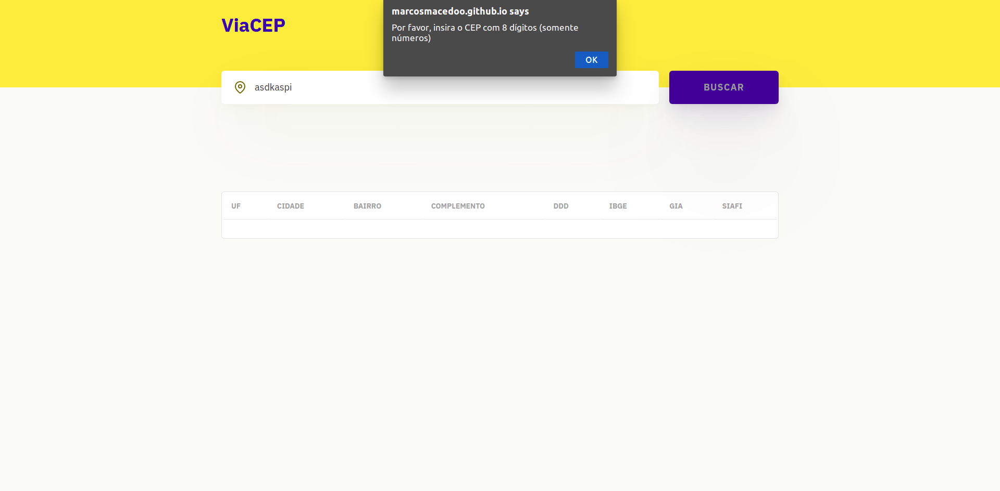

# ViaCEP

<a href="https://marcosmacedoo.github.io/app-desafio-fullstack-eureka/" target="_blank">Veja a aplicação em tempo real</a>

## Tecnologias/Biblioteca utilizadas
- React (ContextAPI e Hooks)
- TypeScript
- Styled Componentes
- Axios
- Prettier
- Figma - <a href="https://www.figma.com/file/caki6u4YEIfN0fsrGX1uAT/ViaCEP?node-id=0%3A1" target="_blank">Veja o protótipo</a>

---

## Apresentação da Aplicação

### Estado inicial

### Listando os dados do CEP buscado

### Realizando busca por CEP

### Inserindo CEP inválido

### Versão Tablet

### Versão Mobile

---

## Utilizando localmente
- Dê um `git clone git@github.com:marcosmacedoo/app-desafio-fullstack-eureka.git`;
- Entre na pasta `app-desafio-fullstack-eureka/`;
- Baixe as dependências do projeto `npm install` ou `yarn`;
- E para executar o projeto `npm run start` ou `yarn start`.
